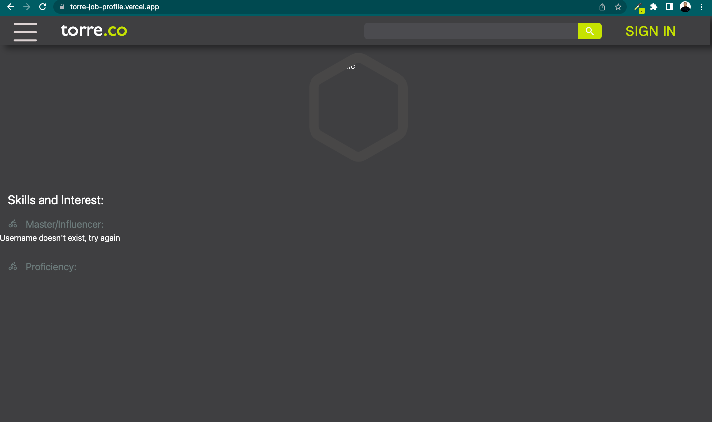
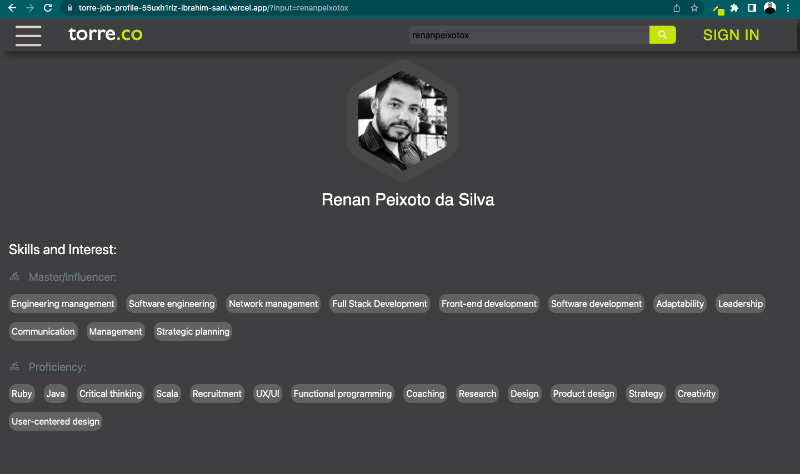
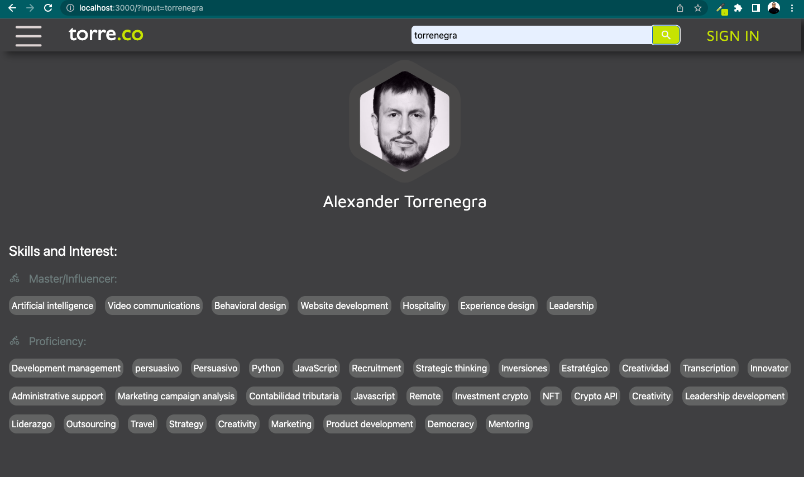

# Torre Skills Profile Web App

This [Web app](https://torre-job-profile.vercel.app/) calls the torre API and lists the skills and Proficiency of any given user

## Accessing Torre Skills Profile

Link to deployed App : [torre skills profile](https://torre-job-profile.vercel.app/)

### Running on a Local Server

- First, create a Next.js app using

```bash
yarn create next-app
```

```bash
yarn dev or
yarn start
```

Open [http://localhost:3000](http://localhost:3000) with your browser to see the result.

#### **Testing the Application**

#### Default Landing Page

The default landing page is the first webpage that a user sees when they visit a website or click on a link to the site. This page serves as an introduction to the site and its content, with the goal of engaging users and encouraging them to explore further. The default landing page for this project is given below:



#### **Searching the Username "renanpeixotox"**

- The following output is displayed when the given username "renanpeixotox" is searched.



#### **Searching the Username "torrenegra"**

The following output is displayed when the given username "torrenegra" is searched.

#### Deployed on Vercel

This webapp was deployed onThe easiest way to deploy Next.js app is to use the [Vercel Platform](https://vercel.com/new?utm_medium=default-template&filter=next.js&utm_source=create-next-app&utm_campaign=create-next-app-readme) from the creators of Next.js.
